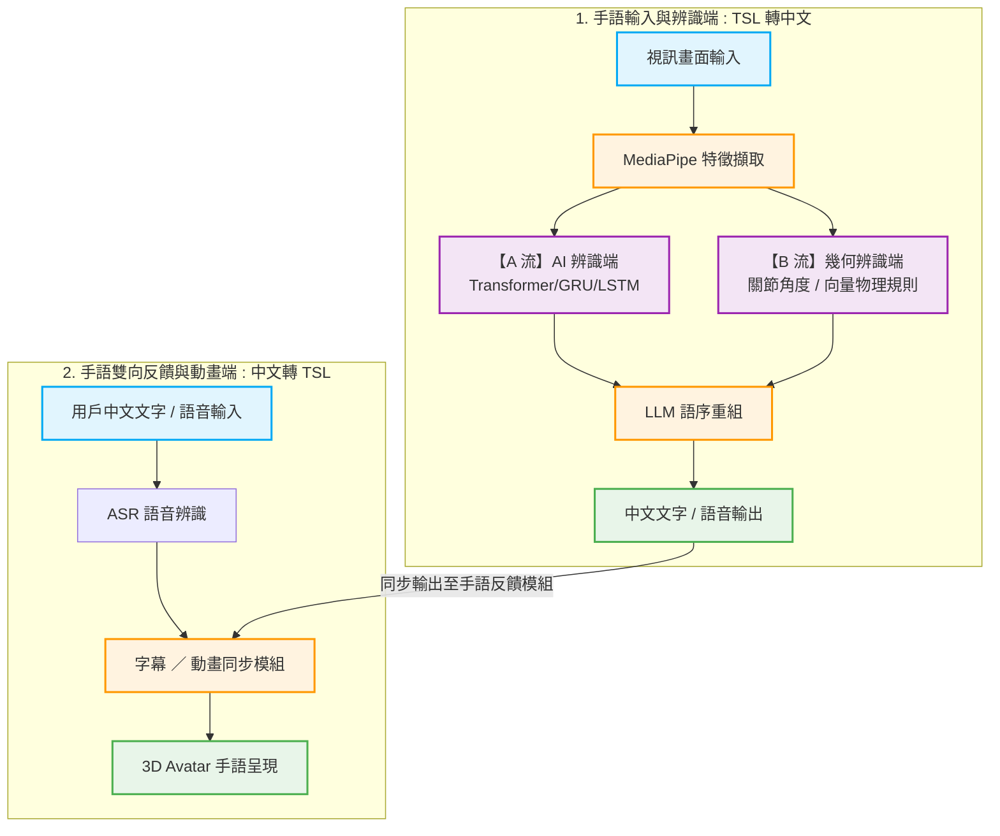

# Sign-Language-interpreter


本系統旨在提供**台灣手語 (TSL)** 與**中文（文字/語音）**之間的即時雙向翻譯，促進聽障人士與一般人士在日常生活中的溝通。

> 📢 **專案開發階段聲明**：本專案目前處於**分模態核心開發與實驗階段**。各核心模組（雙流辨識演算法、LLM 語意轉換、3D 動畫生成）正同步進行獨立算法驗證與測試，後續將透過 WebSocket / API 進行全系統串接整合。

---

## 📌 系統簡介與開發背景

### 開發背景
現有溝通工具多依賴文字輸入或視訊聯繫，對於以手語為母語的聽障族群而言，轉換至文字邏輯仍存在思維門檻。目前市面上的手語辨識多針對美國手語 (ASL)，台灣手語 (TSL) 的即時翻譯工具相對匱乏。此外，手語的語法結構（如語序倒裝、表情配合）與口語中文存在顯著差異，需要更深層的語意轉換機制。

### 開發動機
本專案的核心動機在於開發一個屬於台灣本土的雙向翻譯平台，讓手語使用者能以熟悉的肢體語言表達，同時讓不具備手語能力的聽人能透過語音或文字無障礙地理解對方的意思，進而提升醫療、櫃台服務及日常生活的互動品質。

### 系統特色與創新性
* **🔄 即時雙向翻譯（規劃中）**：支援「手語錄入轉文字/語音」與「文字/語音輸入轉手語」雙向並行。
* **🧠 創新「雙流手勢辨識機制」（核心開發中）**：為了兼顧辨識的泛化能力與精準度，系統整合了兩大辨識主流：
  * **【A 流】AI 深度學習辨識**：利用時序模型學習複雜的手語句型與上下文語意。
  * **【B 流】幾何特徵規則辨識**：透過計算手指關節角度、空間向量與相對距離等物理幾何特徵，針對關鍵單詞進行精準的物理校正。
* **🙌 多模態特徵整合**：利用 MediaPipe Holistic 擷取手部（21 點骨架）、臉部表情（口型、眉毛）與全身姿態資料，提供雙流辨識模組足夠的特徵基底。
* **🤖 擬真 3D 視覺化（動作庫建立中）**：使用 Blender 進行骨架綁定，並預計透過 Three.js 於網頁端驅動 3D 虛擬角色（Avatar）呈現手語。

---

## 🏗️ 系統架構與設計藍圖 (System Architecture)

本系統採獨立模組化並行開發。後端採用 **AI 與幾何特徵雙軌並流（Dual-stream）** 的辨識機制，並導入 **LLM（大型語言模型）** 進行精準的台灣手語與中文語序重組，實現流暢的雙向閉環（Closed-loop）互動：



### 各模組功能與現階段分工說明

1. **使用者介面層（Web 前端 UI 草案）**
   * **功能描述**：提供網頁端視訊畫面、翻譯結果顯示區，並內嵌 Three.js 3D 虛擬角色。
   * **開發技術**：HTML5、CSS3、JavaScript、Three.js。

2. **MediaPipe 特徵擷取模組**
   * **功能描述**：利用 `MediaPipe Holistic` 追蹤並擷取手部 21 點骨架、臉部表情與全身姿態，將其序列化為 JSON 格式之時序關鍵點資料，作為後端雙流辨識的共同底數據。
   * **開發技術**：Python、OpenCV、MediaPipe。

3. **手語辨識模組 —【A 流：AI 深度學習】**
   * **功能描述**：接收特徵點的時序資料，經由深度學習模型進行複雜句型與語意上下文的特徵識別，輸出初步的手語詞彙（Gloss）。
   * **開發技術**：PyTorch、Transformer / GRU 模型。

4. **手語辨識模組 —【B 流：幾何特徵規則】**
   * **功能描述**：直接計算手指關節間的角度、空間向量與相對距離，利用 Rule-based（基於規則）的物理演算法進行特定關鍵單詞的精準物理校正與補強。
   * **開發技術**：Python、NumPy（幾何向量計算）。

5. **大型語言模型語意重組引擎（LLM Engine）**
   * **功能描述**：利用 LLM 強大的自然語言理解能力，將 A/B 雙流辨識出的手語詞彙（Gloss），依據台灣手語文法進行語序倒裝調整與潤飾，轉譯為符合自然中文文法的語句輸出。
   * **開發技術**：LLM API 串接、Prompt Tuning。

6. **3D 手語動畫生成與字幕同步模組**
   * **功能描述**：在 Blender 中完成 3D 角色骨架綁定（Armature Rig）與手語動作 Keyframe 片段製作。本模組具備**雙軌驅動能力**：除了能接收外部輸入的中文轉為手語外，也能將系統辨識完經 LLM 重組後的中文再次轉為手語動畫，供聽障使用者進行**即時雙向反饋驗證**。
   * **開發技術**：Blender（動作庫製作）、Three.js（網頁端動態 Clip 組合播放與字幕控制器）。

## 📂 專案目錄結構 (Project Structure)

目前專案目錄依據組員功能分工進行切分，各組員於對應資料夾下進行獨立開發、資料收集與演算法實驗，以便於未來進行模組化串接：
```
Sign-Language-interpreter/
├── sign_language_ai/        # 後端手勢雙流辨識核心資料夾
│   ├── LSTM/                # 【A 流】LSTM 模型目錄 (主要資料源)
│   │   ├── labels.py        # 建立標籤供訓練程式使用
│   │   ├── labels.csv       # 標籤映射表 (CSV)
│   │   ├── label_map.json   # 標籤映射字典 (JSON)
│   │   ├── number.py        # 原始影片重新命名與排序工具 (防亂碼)
│   │   ├── video_to_npy.py  # 調用 MediaPipe 將原始影片轉為 npy 時序特徵檔
│   │   ├── train_lstm.py    # LSTM 模型訓練主程式
│   │   ├── sign_lstm.pth    # 最終訓練完成的 LSTM 模型權重
│   │   ├── best_sign_model.pth # 訓練過程中 Loss 最小的最佳模型權重
│   │   └── realtime_demo_lstm.py # 載入 LSTM 權重之攝影機即時辨識測試腳本
│   │
│   ├── GRU/                 # 【A 流】GRU 模型目錄
│   │   ├── labels.py        # 建立標籤供訓練程式使用
│   │   ├── labels.csv       # 標籤映射表 (CSV)
│   │   ├── label_map.json   # 標籤映射字典 (JSON)
│   │   ├── train_gru.py     # GRU 模型訓練主程式 (讀取 LSTM/data 下之資料)
│   │   ├── sign_gru.pth     # 最終訓練完成的 GRU 模型權重
│   │   ├── best_sign_gru_model.pth # 訓練過程中 Loss 最小的最佳 GRU 權重
│   │   └── demo_gru.py      # 載入 GRU 權重之攝影機即時辨識測試腳本
│   │
│   └── transformer/         # 【A 流】Transformer 模型目錄
│       ├── make_labels.py        # 建立標籤供訓練程式使用
│       ├── labels.csv       # 標籤映射表 (CSV)
│       ├── label_map.json   # 標籤映射字典 (JSON)
│       ├── train_transformer.py # Transformer 訓練主程式 (讀取 LSTM/data 下之資料)
│       ├── sign_transformer.pth # 最終訓練完成的 Transformer 模型權重
│       ├── best_transformer_model.pth # 訓練過程中 Loss 最小的最佳權重
│       └── realtime_demo.py # 載入 Transformer 權重之攝影機即時辨識測試腳本
├── 專題設計規格書.pdf
├── 期中專題簡報.pdf
├── 期末專題簡報.pdf
├── LICENSE
└── README.md
```
## ⚡ 獨立模組安裝與測試說明 (Development & Testing)

由於目前系統尚未完全串接，請依據欲測試的模組分別進行環境配置與獨立執行驗證。

### 後端 A 流（AI 深度學習辨識端）獨立實驗步驟

#### 1. 環境套件建置
確保您的 Python 環境為 3.9 以上，並安裝 MediaPipe、OpenCV 與深度學習核心套件：
```bash
pip install mediapipe opencv-python numpy torch
```
#### 2. 資料預處理與特徵提取 (以 LSTM 目錄為基礎)
若需自行擴大詞彙或重新抽取特徵，請將影片置於 sign_language_ai/LSTM/videos/ 中並執行：
```bash
cd sign_language_ai/LSTM

# 1. 將影片進行數字排序命名
python number.py

# 2. 建立訓練所需的標籤
python labels.py

# 3. 調用 MediaPipe 進行特徵點提取並生成 npy 檔案
python video_to_npy.py
```
#### 3. 模型訓練與即時 Camera 測試
您可以選擇進入 sign_language_ai 底下的三種架構進行獨立模型訓練與實時相機測試：
LSTM 架構實驗：
```bash
cd sign_language_ai/LSTM
python train_lstm.py             # 開始訓練
python realtime_demo_lstm.py     # 載入訓練權重進行相機即時辨識測試
```
GRU 架構實驗：
```bash
cd sign_language_ai/GRU
python train_gru.py              # 開始訓練 (讀取 LSTM 內資料源)
python demo_gru.py               # 載入訓練權重進行相機即時辨識測試
```
Transformer 架構實驗：
```bash
cd sign_language_ai/transformer
python train_transformer.py      # 開始訓練 (讀取 LSTM 內資料源)
python realtime_demo.py          # 載入訓練權重進行相機即時辨識測試
```

### 後端 B 流（幾何邏輯辨識端）獨立實驗步驟
B 流核心採用專家幾何規則匹配與時序狀態機管線，跳過深度學習模型的訓練成本，直接將 database.xlsx 內的 MediaPipe 3D 拓樸座標閾值鏈轉譯為即時判定結果。

#### 1. 規則資料庫動態配置
B流的辨識規則完全由 database.xlsx 的 工作表3 進行管理。若需新增或修改手勢幾何邏輯，請直接編輯該 Excel 檔的 「MediaPipe 關鍵特徵」 欄位。

-- 一般靜態手勢：使用布林與比較運算子連結特徵變數（如：is_flat_HAND and dist_HAND_8_FACE_1 < 0.5）。

-- 動態連續手勢：使用時序語法結構定義多步驟動態軌跡（如：sequence([步驟1邏輯], [步驟2邏輯])）。

#### 2. 獨立語法檢查與安全規則評估測試
為了防止外部惡意修改 Excel 注入危險代碼，系統內建基於 AST（抽象語法樹）的 SafeRuleEvaluator 安全解析引擎，不使用危險的 eval()。可執行以下獨立指令進行核心邏輯與安全性測試：
```bash
# 1. 驗證 B 流獨立模組與依賴環境之語法正確性
python -m py_compile b_stream.py core\safe_rule_engine.py

# 2. 測試安全規則解析器（模擬正常幾何閾值觸發）
python -c "from core.safe_rule_engine import SafeRuleEvaluator; ev=SafeRuleEvaluator(); print(ev.evaluate('is_flat_HAND and dist_HAND_8_FACE_1 < 0.5', {'is_flat_HAND': True, 'dist_HAND_8_FACE_1': 0.3}))"
# 預期輸出：含有 matched=True 的評估結果

# 3. 測試安全性防禦機制（驗證惡意代碼/危險函式呼叫是否成功遭攔截）
python -c "from core.safe_rule_engine import SafeRuleEvaluator; ev=SafeRuleEvaluator(); print(ev.evaluate('danger()', {}))"
# 預期輸出：明確顯示不支援「Call」或禁止執行任意 Python 程式碼之警告
```
#### 3. B 流即時判定與 3 幀穩定器測試
B 流內建 required_stable_frames = 3 的防抖動防誤判機制。若要對 B 流進行獨立的即時影像流測試，可直接查閱日誌或運行封裝測試：
```bash
# 查看 B 流系統初始化與專家規則載入狀態
python -c "from b_stream import BStreamGestureMatcher; matcher = BStreamGestureMatcher(excel_path='database.xlsx')"

# 於執行 main.py 時，每 30 幀可在終點端查閱「📦 [給B流的特徵]」實時動態特徵張量日誌
```
### 雲端 LLM（語意校正翻譯端）獨立實驗步驟
LLM 翻譯端專職負責非同步手語語序重組、混淆詞上下文去歧義，以及網路異常時的自動多模型容錯轉移（Failover Routing）。

#### 1. 異步翻譯工作環境建置
確保專案根目錄已建立 .env 設定檔並正確填入金鑰，同時安裝環境變數與網路請求套件：

```bash
# 安裝依賴套件
pip install python-dotenv requests

# 於專案根目錄下建立 .env 檔，內容如下：
GEMINI_API_KEY=您的_GOOGLE_GEMINI_API_KEY
```
#### 2. 離線沙盒（Mock）與真實雲端 API 切換測試
TranslationWorker 支援離線沙盒模式與真實雲端 API 模式。測試前請於 main.py 調整 use_real_api 參數：

-- 離線測試 (Mock 模式)：use_real_api=False，系統將模擬 1 秒非同步延遲並回傳測試單字組，不消耗 API 額度。

-- 真實翻譯模式：use_real_api=True，系統會直接呼叫 Google 雲端 API，依據 system_instruction 的 TSL 語法規範執行繁中語意潤飾。


#### 3. 自動容錯轉移 (Failover) 與連線驗證測試
為確保學校防火牆、超時（Timeout）或免費額度耗盡（HTTP 429 / 503 異常）時系統不會崩潰卡死，本系統內建三級備援路由機制。可在啟動主程式前執行獨立連線健康檢查：

```bash
# 執行自動化連線驗證測試（自動檢測三級模型可用性）
# 系統將按順序測試路由：gemini-2.5-flash → gemini-2.5-flash-lite → gemini-flash-latest
python -c "
import os, requests; from dotenv import load_dotenv; load_dotenv();
key = os.getenv('GEMINI_API_KEY', '').strip();
for m in ['gemini-2.5-flash', 'gemini-2.5-flash-lite', 'gemini-flash-latest']:
    url = f'https://generativelanguage.googleapis.com/v1beta/models/{m}:generateContent?key={key}';
    try:
        r = requests.post(url, json={'contents': [{'parts': [{'text': 'hi'}]}], 'generationConfig': {'maxOutputTokens': 5}}, timeout=8);
        print(f'  Model [{m}] status: {r.status_code} ' + ('✅ 可用' if r.status_code==200 else '❌ 無法使用'));
    except Exception as e: print(f'  Model [{m}] 網路連線失敗: {e}')
"
```
#### 4. 智慧中斷點觸發（Smart Triggering）實時測試
當手語使用者比劃結束並放下雙手時，後台非同步執行緒將自動觸發翻譯流程：

-- 運行 python main.py 並開啟 Webcam。

-- 在鏡頭前比劃一組手勢（如：比劃「我」、「學校」、「去」）。

-- 觸發中斷點：將雙手完全放下或移出畫面、或是保持動作停滯超過 2.0 秒 (Debounce Time)。

-- 預期效果：底端黑色 UI 區塊將即時由 收集單字：我 學校 去 動態切換為 AI 翻譯中...，隨後渲染出精準校正後的繁體中文句子：我往學校去。（或 我往學校。），且影像擷取與骨架渲染始終維持穩定 FPS 不卡頓。

## ⚙️ 系統預期非功能性需求 (QoS 目標)
在未來的系統整合階段，本團隊將以以下指標作為非功能性規格之優化目標：

⚡ 效能與低延遲：整體雙向翻譯運算延遲（Latency）控制在 2~3 秒 內；3D 動畫渲染幀率需穩定維持在 30 FPS 以上，以確保手語動作流暢、清晰可辨。

🔒 隱私與安全性：系統運作期間擷取之使用者影像，僅用於即時特徵點提取，伺服器端不得永久儲存任何原始視訊檔案與隱私畫面，以符合個資保護原則。

♿ 可用性設計：考量聽障人士需求，使用者介面（UI）需具備清晰的文字顯示區，且在辨識失敗或環境光線不足時，提供視覺化的狀態提示。

🧩 擴充性需求：手語動作資料庫與語意分析模組採模組化解耦設計，以利未來新增手語詞彙或支援其他語系。

## 🎯預計貢獻
1. 強化日常溝通自主性：提升聽障者在日常社交、門診醫療或臨櫃服務等公共情境中的即時溝通能力，減少對同步手語翻譯員的依賴。

2. 完備雙向翻譯技術鏈：整合「手語辨識」與「動畫生成」技術，補足現有工具多為單向轉換的不足，實現真正的對等溝通。

3. 建立本土手語 AI 技術基礎：針對台灣手語（TSL）建立標準化的資料處理流程、關鍵點特徵抽取標準與模型訓練策略，為未來 TSL NLP 與相關 AI 應用提供可靠的技術架構。

4. 推動科技助殘與社會共融：透過技術手段消除溝通門檻，提升多樣化服務情境下的友善度與品質。

## 👥 開發團隊與分工 (Authors)
李宜穎 — 負責 sign_language_ai/：A 流 AI 深度學習辨識端設計，包含 LSTM / GRU / Transformer 模型架構搭建、資料預處理與時序詞彙量擴大。

周語旋 — 負責 B 流（幾何特徵規則辨識演算法研發）與後端 LLM 大型語言模型語意重組引擎整合。

吳珮甄 — 負責 3D 動畫組：Blender 3D 虛擬角色（Avatar）骨架綁定、手語動作 Keyframe 動作庫建立。

尹品臻 — 負責 使用者介面層（Web 前端 UI 設計、版面配置與前端視覺化草案規劃）。

## 📄 授權條款 (License)
本專案採用 MIT License 進行授權。
